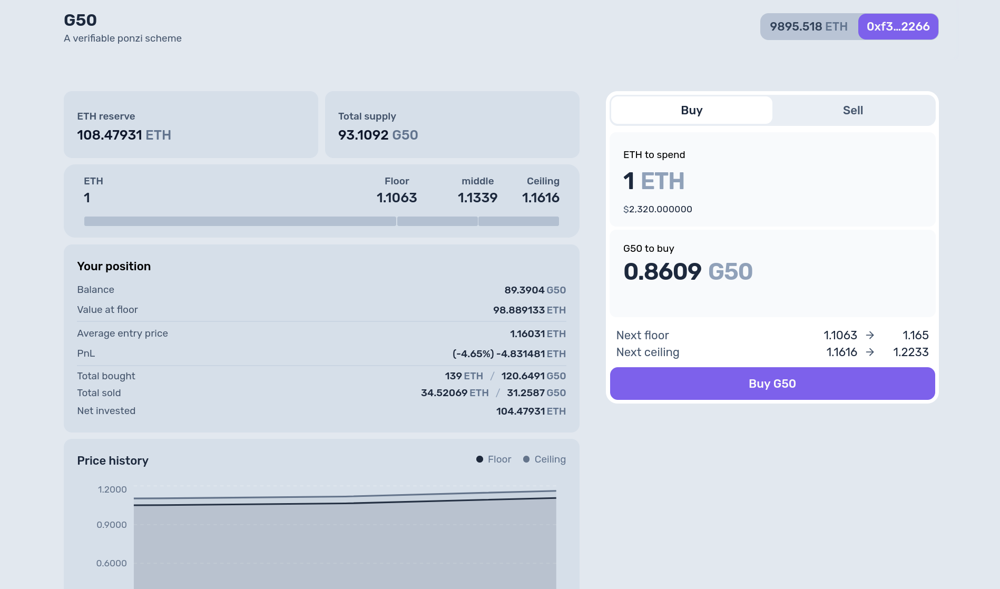

# G50

G50 is a verifiable ponzi-scheme experiment implemented as an on-chain token mechanic.

The core rule is simple: buy at the ceiling, sell at the floor.

Each new buyer pays a premium above the current floor. That spread stays in the contract and pushes the backing per token upward, so the floor rises as buyers enter. On-chain, floor and ceiling are refreshed in discrete updates during trading.

This project is an experiment, not a financial product, investment vehicle, or viable trading tool. Interacting with it may result in total loss of funds.



## Project Layout

- `src/`: Solidity contracts
- `script/`: Foundry deploy and seed scripts
- `frontend/`: Next.js app for the local demo
- `frontend/generated/contracts.ts`: auto-written by `make s0` to `make s4`

## Requirements

- Foundry (`forge`, `cast`, `anvil`)
- `make`
- `jq`
- Bun

## Run Locally

Start a local chain, deploy the contract, and seed a scenario:

```bash
make s1
```

Other useful scenarios:

```bash
make s2
make s3
```

Useful helpers:

```bash
make s0    # fresh deploy, no activity
make s4    # heavier activity
make kill  # stop Anvil
```

Then start the frontend:

```bash
cd frontend
bun i
bun run dev
```

Open `http://localhost:3000`.

The frontend is configured for the local Foundry chain (`31337`). Run one of the `make s*` targets first so the contract address is generated for the UI.
